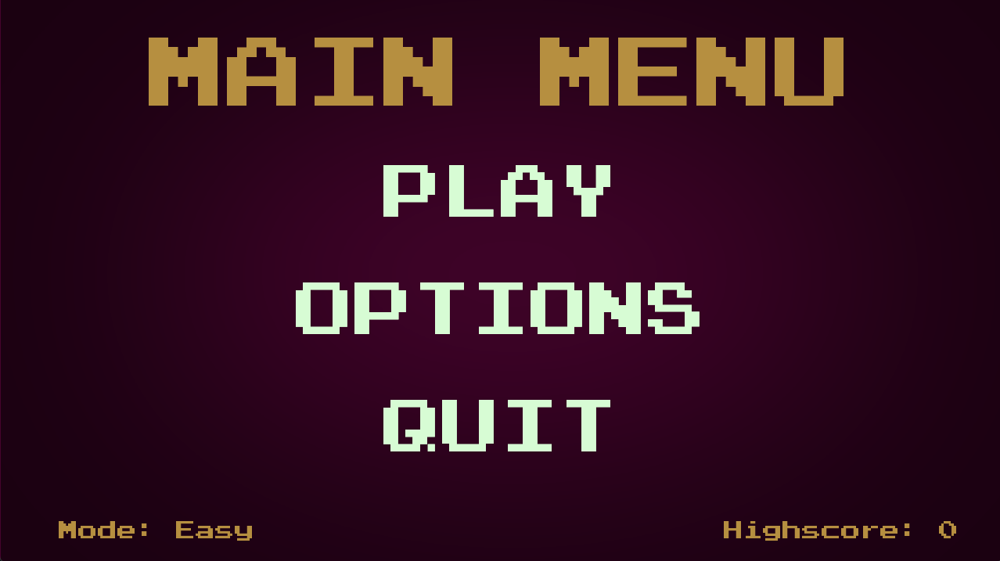
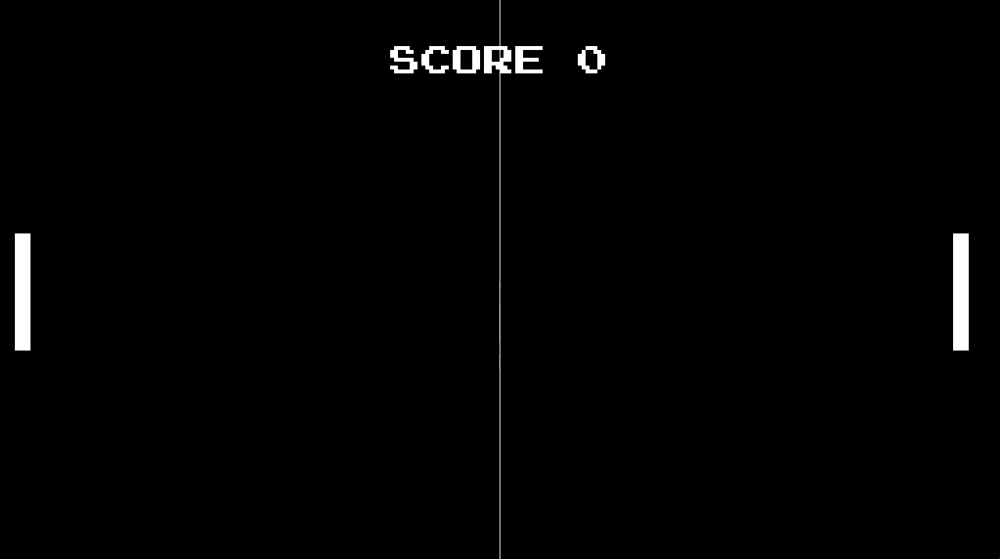
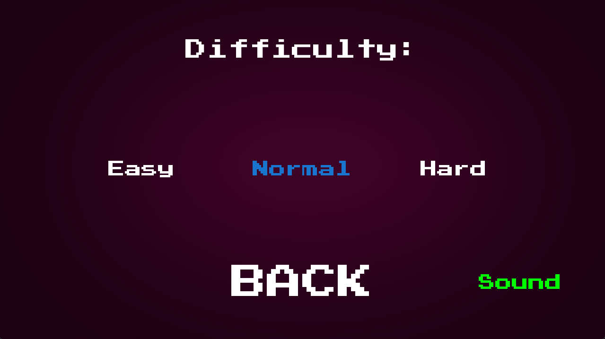

# Ping Pong Game

A professional Ping Pong game implemented in Python using the pygame library. Experience the classic 2D gameplay, compete against friends, and enjoy the interactive and engaging features of this game.

## Installation

1. Clone the repository:

Open a Command Prompt

git clone https://github.com/yosxke/PingPongGame.git

2. Navigate to the project directory:

cd PingPongGame

3. Install the required dependencies using the install.bat:

open install.bat

## Usage

1. Run the game:

Run the Game by opening the run.bat

2. Use the following controls to play the game:

- Left Player: W (Up), S (Down)
- Right Player: UP arrow key (Up), DOWN arrow key (Down)

3. Select the desired difficulty level from the Options (Easy, Normal, Hard).

4. Enjoy the Ping Pong game and compete to achieve the highest score!

## Showcase

Include the following screenshots to showcase different aspects of your game:

1. Menu Screen: 

    

2. Gameplay: 

    

3. Highscore:

    

4. Customization: 

    

## Contributing

Contributions are welcome! If you would like to contribute to this project, please follow these steps:

1. Fork the repository.
2. Create a new branch for your feature or bug fix.
3. Make your changes and commit them with descriptive commit messages.
4. Push your changes to your forked repository.
5. Submit a pull request to the main repository.

For any inquiries or feedback, please contact [ME](mailto:jannik.schreier@gmx.de).

## Credits

Credits to [@BaralTech](https://www.youtube.com/watch?v=GMBqjxcKogA&t=2s)

